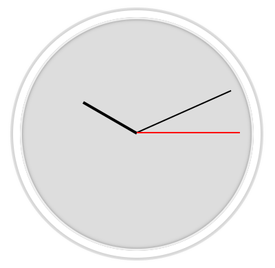

# JS and CSS Clock

Day 2 of Wes Bos's challenge to build 30 things in 30 days using vallina JavaScript.

I created a ticking clock with rotating hands using the Date() object and its relevant methods.

<h2>Lessons Learned</h2>
<h3>CSS</h3>
<ul>
  <li>The hands of the clock must be transformed to point to noon. To do this, the origin of transformation must be changed, otherwsie the hands will rotate from the middle of the hand, instead of from the middle of the clock.</li>
  <li>The transition and transition-timing-function of the hands can be experimented with to create a cool ticking effect.</li>
</ul>

<h3>JS</h3>
<ul>
  <li>Date() is a built-in object with the current date. It has a number of methods, including getHours(), getMinutes(), and getSeconds().</li>
  <li>After getting the current time, the seconds, minutes and hours must be converted to degrees. Also, the CSS used to offset the degrees so that the hands point to noon must be accounted for.</li>
  <li>To wrap everything up, each hand element is rotated according to the degrees that were converted.</li>
  <li>The function gets called every second.
</ul>

<h2>Links</h2>

Wes Bos's Tutorial: www.javascript30.com

Live on Codepen: https://codepen.io/sahar13/pen/MEjNaj?editors=1010

